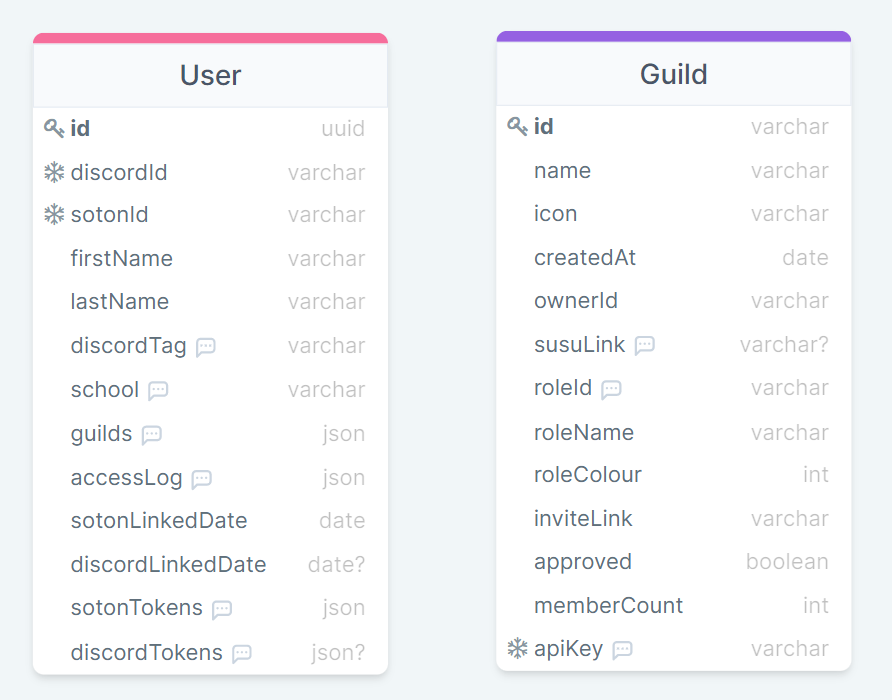

# University of Southampton Discord verification service
Service to globally verify and link Southampton students to their Discord accounts


## Run Locally

Clone the project

```bash
  git clone https://github.com/ecss-soton/verify.git
```

Go to the project directory

```bash
  cd verify
```

Install dependencies

```bash
  npm install
```

Have a PostgreSQL server running

Configure the environment variables. See [Environment Variables]

Sync the database with the local schema

```bash
  npm run prisma:dbpush
```

Start the server

```bash
  npm run start
```

Or start with auto refresh in development mode

```bash
  npm run dev
```

### Docker image

TODO Add docker image link with dockerfile

## Schema



## Running Tests

To run tests, run the following command

```bash
  npm run test
```

## Roadmap

- Get everything working

- Write a roadmap

## Documentation

How this service works

### Authorization

All requests must supply a `Authorization` HTTP header in the format: `Authorization: TOKEN`

#### Example Authorization header

```
Authorization: b583ef41-9c75-41a4-b4ec-19feb0befbd6
```

### Rate limiting

Currently there are no rate limits in palce

### API Reference

#### Get details about a user

```http
  GET /api/v1/user/:userId
```

| Parameter       | Type     | Description                                                                                                                                         |
|:----------------|:---------|:----------------------------------------------------------------------------------------------------------------------------------------------------|
| `userId`        | `string` | **Required**. The discord Id of the user you are fetching                                                                                           |
| `guildId`       | `string` | **Required**. The discord guild Id that is fetching this information <br/> Note that the user must be in the guild otherwise a 404 will be returned |
| `Authorization` | `string` | **Required**. The API key that fetches this information                                                                                             |

Returns

```json
{
    "id": "a1cbcb06-b5d8-4769-bbc1-352cf3ebfc4b",
    "discordId": "267292139208048641",
    "sotonId": "ec3g21",
    "firstName": "Euan",
    "lastName": "Caskie",
    "discordTag": "Ortovox#9235",
    "school": "Electronics & Computer Science (Student)",
    "sotonLinkedDate": "2022-06-25T21:25:51.901Z",
    "discordLinkedDate": "2022-06-25T21:47:53.032Z"
}
```

#### Get item

```http
  GET /api/v1/user/:id/tokens
```

| Parameter | Type     | Description                                                          |
|:----------|:---------|:---------------------------------------------------------------------|
| `userId`  | `string` | **Required**. The discord Id of the user you are fetching            |
| `guildId` | `string` | **Required**. The discord guild Id that is fetching this information |

Returns

```json
{
    "discord": {
        "auth_token": "a1cbcb06-b5d8-4769-bbc1-352cf3ebfc4b",
    },
    "microsoft": {
        "auth_token": "a1cbcb06-b5d8-4769-bbc1-352cf3ebfc4b",
    }
}
```