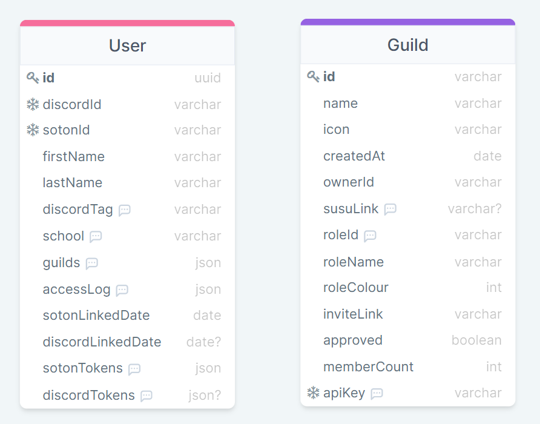

# University of Southampton Discord verification service
Service to globally verify and link Southampton students to their Discord accounts


## Run Locally

Clone the project

```bash
  git clone https://github.com/ecss-soton/verify.git
```

Go to the project directory

```bash
  cd verify
```

Install dependencies

```bash
  npm install
```

Have a PostgreSQL server running

Configure the environment variables. See [Environment Variables]

Sync the database with the local schema

```bash
  npm run prisma:dbpush
```

Start the server

```bash
  npm run start
```

Or start with auto refresh in development mode

```bash
  npm run dev
```

### Docker image

TODO Add docker image link with dockerfile

## Schema



## Running Tests

To run tests, run the following command

```bash
  npm run test
```

## Roadmap

- Get everything working

- Write a roadmap

## Documentation

How this service works

### Authorization

All requests must supply a `Authorization` HTTP header in the format: `Authorization: TOKEN`

#### Example Authorization header

```
Authorization: b583ef41-9c75-41a4-b4ec-19feb0befbd6
```

### Rate limiting

Currently, there are no rate limits in place

### API Reference

#### Check if a user is verified or not

```http
  GET /api/v1/verified
```

| Body params | Type     | Description                                                          |
|:------------|:---------|:---------------------------------------------------------------------|
| `userId`    | `string` | **Required**. The discord user Id to check for                       |
| `guildId`   | `string` | **Required**. The discord guild Id that is fetching this information |

Returns

200 - Success
```json
{
    "verified": true,
    "roleId": "696959662511358032",
    "sotonLinkedDate": "2022-06-25T21:25:51.901Z",
    "discordLinkedDate": "2022-06-25T21:47:53.032Z"
}
```

400 - Bad request
```json
{
    "error": true,
    "message": "Bad request"
}
```

404 - User not found
```json
{
    "error": true,
    "message": "This user does not exist or is not verified in this guild"
}
```

#### Get details about a user

```http
  GET /api/v1/user/:userId
```

| Query params    | Type     | Description                                                                                                                                         |
|:----------------|:---------|:----------------------------------------------------------------------------------------------------------------------------------------------------|
| `userId`        | `string` | **Required**. The discord Id of the user you are fetching                                                                                           |

| Body params     | Type     | Description                                                                                                                                         |
|:----------------|:---------|:----------------------------------------------------------------------------------------------------------------------------------------------------|
| `guildId`       | `string` | **Required**. The discord guild Id that is fetching this information <br/> Note that the user must be in the guild otherwise a 404 will be returned |

Returns

200 - Success
```json
{
    "id": "a1cbcb06-b5d8-4769-bbc1-352cf3ebfc4b",
    "discordId": "267292139208048641",
    "sotonId": "ec3g21",
    "firstName": "Euan",
    "lastName": "Caskie",
    "discordTag": "Ortovox#9235",
    "school": "Electronics & Computer Science (Student)",
    "sotonLinkedDate": "2022-06-25T21:25:51.901Z",
    "discordLinkedDate": "2022-06-25T21:47:53.032Z"
}
```

400 - Bad request
```json
{
    "error": true,
    "message": "Bad request"
}
```

404 - User not found
```json
{
    "error": true,
    "message": "This user does not exist or is not verified in this guild"
}
```

#### Get guild information

```http
  GET /api/v1/guild/:guildId
```

| Query params | Type     | Description                                              |
|:-------------|:---------|:---------------------------------------------------------|
| `guildId`    | `string` | **Required**. The guild Id of the guild you are fetching |

Returns

200 - Success
```json
{
    "id": "689530901142831105",
    "name": "Southampton ECSS",
    "icon": "f67bc40260c9ab413c17cf092308f27c",
    "createdAt": "2022-06-25T21:47:53.032Z",
    "ownerId": "267292139208048641",
    "susuLink": "https://www.susu.org/groups/ecss",
    "roleId": "696959662511358032",
    "roleName": "Verified",
    "roleColour": 987862,
    "approved": true
}
```

404 - Guild not found
```json
{
    "error": true,
    "message": "This guild does not exist"
}
```

#### Register a new gulid

```http
  POST /api/v1/guild/register
```

| Body params  | Type      | Description                                                                   |
|:-------------|:----------|:------------------------------------------------------------------------------|
| `id`         | `string`  | **Required**. The guild Id of the guild you are registering                   |
| `name`       | `string`  | **Required**. The name of the guild you are registering                       |
| `ownerId`    | `string`  | **Required**. The discord owner Id of the guild you are registering           |
| `roleId`     | `string`  | **Required**. The role Id for the role to be applied when a user verified     |
| `roleName`   | `string`  | **Required**. The role name for the role to be applied when a user verified   |
| `roleColour` | `integer` | **Required**. The role colour for the role to be applied when a user verified |
| `icon`       | `string`  | The icon hash of the guild you are registering                                |
| `susuLink`   | `string`  | The official susu link of the guild you are registering                       |

Returns

200 - Success
```json
{
    "registered": true,
    "approved": false
}
```

409 - Guild already exists
```json
{
    "error": true,
    "message": "This guild has already been registered"
}
```